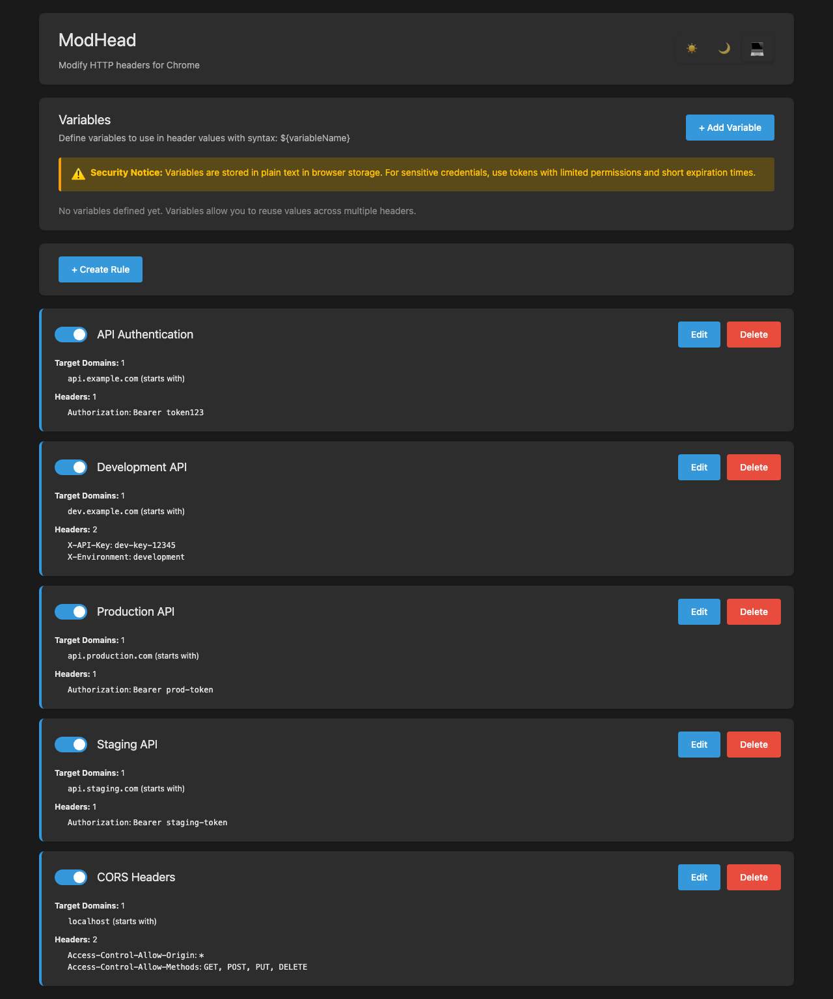

# ModHead

ModHead is a Chrome extension that allows you to easily modify HTTP request headers. Key features: variables support and one-click token refresh from server.

[](https://chromewebstore.google.com/detail/modhead/pmclmkblliojpoebeebgphpelnhflmae)



## ✨ Features

- **🔧 Header Modification** - Add, modify, or remove any HTTP request headers
- **🎯 URL Pattern Matching** - Target URLs with flexible matching:
  - `startsWith` - URL starts with the pattern
  - `endsWith` - URL ends with the pattern
  - `equals` - Exact URL match
- **📍 Tab URL Filtering** - Apply rules only when on specific websites
- **🔄 Variables System** - Define reusable values with `${variableName}` syntax
- **⚡ Token Refresh** - Update tokens via HTTP request with one click
- **🎨 Dark Theme** - Comfortable viewing in any lighting

## 📦 Installation

### Chrome Web Store

Install directly from the [Chrome Web Store](https://chromewebstore.google.com/detail/modhead/pmclmkblliojpoebeebgphpelnhflmae).

### From Source

1. Clone the repository
   ```bash
   git clone https://github.com/HawkeyePierce89/ModHead
   cd ModHead
   ```

2. Install dependencies
   ```bash
   npm install
   ```

3. Build the extension
   ```bash
   npm run build
   ```

4. Load in Chrome
   - Open `chrome://extensions/`
   - Enable "Developer mode"
   - Click "Load unpacked"
   - Select the `dist/` directory

## 🚀 Quick Start

1. Click the ModHead icon in Chrome toolbar to open Options
2. Click **"Create Rule"**
3. Enter a rule name (e.g., "API Auth")
4. Add a target domain: `api.example.com` with `startsWith` match
5. Add a header: `Authorization` = `Bearer your-token-here`
6. Save and you're done!

All requests to `api.example.com/*` will now include your Authorization header.

## 📚 Documentation

For detailed documentation, visit the [Wiki](https://github.com/HawkeyePierce89/ModHead/wiki):

- [Getting Started](https://github.com/HawkeyePierce89/ModHead/wiki/Getting-Started) - Installation and first steps
- [Variables](https://github.com/HawkeyePierce89/ModHead/wiki/Variables) - Reusable values system
- [Token Refresh](https://github.com/HawkeyePierce89/ModHead/wiki/Auto-Refresh-Tokens) - Refresh tokens via HTTP
- [Examples](https://github.com/HawkeyePierce89/ModHead/wiki/Examples) - Real-world use cases
- [FAQ](https://github.com/HawkeyePierce89/ModHead/wiki/FAQ) - Frequently asked questions

## 📝 License

This project is licensed under the MIT License - see the [LICENSE](LICENSE) file for details.
